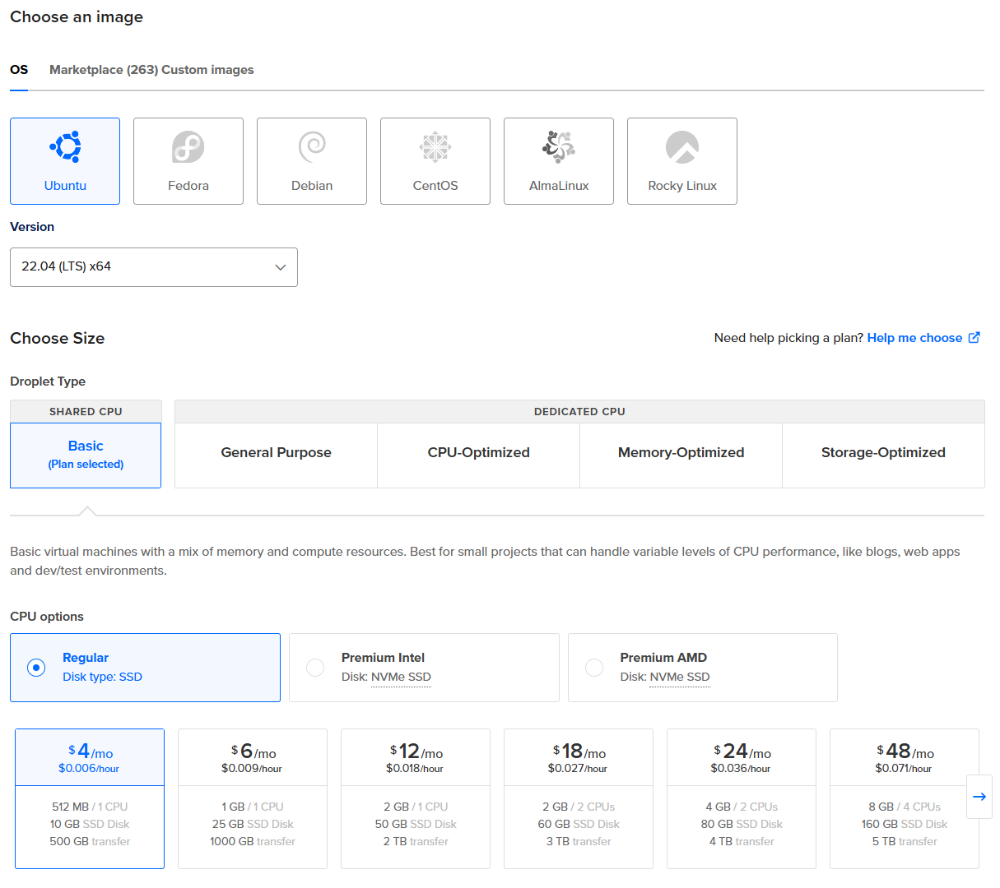
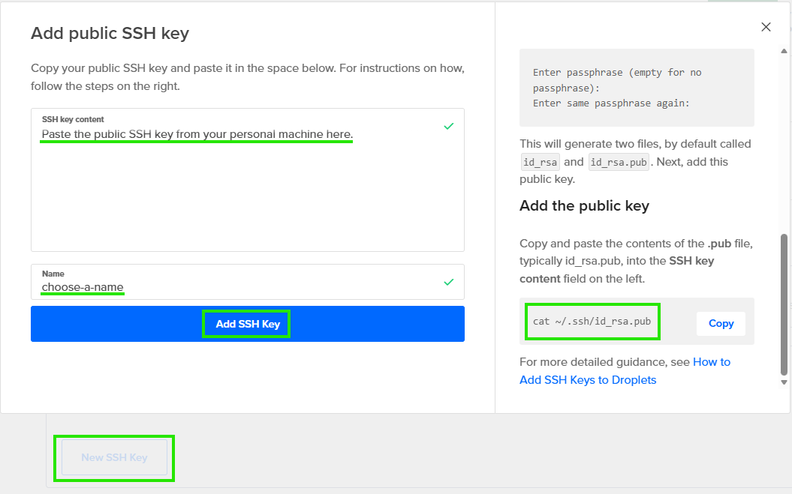

# Module 5 - Cloud & Infrastructure as Service (IaaS) Basics

This guide demonstrates how to deploy a Spring Boot REST API application to a DigitalOcean Droplet. The application features a REST endpoint (`/api/countries`) and a React/Redux frontend that fetches and displays country data. You will learn how to configure a secure Linux server, isolate the application with a dedicated service user, and manage the application lifecycle with Systemd.

## Create a Server and Deploy an Application on Digital Ocean (DO)

In DigitalOcean, a **Droplet** is a Virtual Private Server (VPS). It acts as a lightweight, scalable virtual machine (VM) in the cloud, providing dedicated resources like CPU, RAM, and SSD storage, along with a unique public IP address.

By creating a Droplet, you gain full control over the Operating System (e.g., Ubuntu, CentOS), allowing you to manage it like a standalone physical server.

> [!NOTE]
> For the following steps, we assume your Droplet's public IP is `456.456.456.456`. You will receive your actual IP address via the DigitalOcean UI after creation. The local machine used in this example is a laptop running `Ubuntu 22.04.5`.
>
> The local machine used in this example is a laptop running `Ubuntu 22.04.5`.

---

### Step 1: Create a DigitalOcean Droplet

For this setup, we're using **Ubuntu 22.04** and a "Basic" plan.

1. **Choose an image:** Select **Ubuntu 22.04 (LTS)**.
2. **Choose a plan:** Select the "Basic" Shared CPU plan.
3. **CPU options:** Select regular disk type and basic resources.

<p align="center">
  
</p>

4. **Authentication method:** Select **SSH Key**.

To securely access your server, click **New SSH Key** and follow the on-screen instructions. If you already have a key on your local machine, you can copy it using this command:

```bash
# Print your public SSH key to the terminal
cat ~/.ssh/id_rsa.pub
```

<p align="center">
  
</p>

---

### Step 2: Configure the Initial Firewall

Security is a priority. Before doing anything else, we will restrict access to the server. Navigate to **Networking > Firewalls** in the DigitalOcean dashboard and click **Create Firewall**.

#### Inbound Rules

Define which traffic is allowed to reach your server. For now, we will **only** allow SSH access.

| Type | Protocol | Port Range | Sources | Purpose |
| --- | --- | --- | --- | --- |
| **SSH** | TCP | 22 | `[your-local-machine-public-IP]` | Allows only YOU to access the server terminal. |

* **Find your IP:** You can find your current local IP at [whatismyip.com](https://www.whatismyip.com/).
* **Restricting SSH:** This rule ensures that only devices on your specific network can attempt to log in.

> **Note:** We will open the application port in a later step.

After saving the firewall, go to the **Droplets** tab within the firewall settings, click **Add Droplets**, and select the Droplet you created in Step 1.

---

### Step 3: Connect and Configure a Secure Admin User

For security best practices, you should not perform daily tasks as the `root` user. Instead, create a dedicated admin user using the provided `create_admin_user.sh` script.

**What this script does:**

* **User Creation:** Creates a new system user with a dedicated home directory and Bash access.
* **Elevated Privileges:** Adds the user to the `sudo` group, allowing them to run administrative commands.
* **SSH Security:** Automatically creates the `.ssh` directory and injects your public ssh-key so you can log in without a password.
* **Permission Hardening:** Strictly limits access to the SSH folder (`700`) and keys (`600`) so other users on the system cannot read them.

**Execution:**

1. **Transfer the setup script:** From your **local machine**, copy the `create_admin_user.sh` script to the remote server using `scp` (Secure Copy).

```bash
# Usage: scp [local-path] root@[ip-address]:[remote-path]
scp ./create_admin_user.sh root@456.456.456.456:/root
```

2. **Access the Droplet via ssh:**

```bash
ssh root@456.456.456.456
```

3. **Execute the script on the server:** Once logged in, give the script execution permissions and run it. You must provide your desired **username** and your **public SSH Key** (the same string you used in Step 1) as arguments.

```bash
# Grant execution permissions
chmod u+x create_admin_user.sh

# Run the script: ./create_admin_user.sh "username" "public-ssh-key-string"
./create_admin_user.sh "newadmin" "ssh-rsa AAAAB3NzaC..."
```

4. **Exit the server:** Once the user is created, log out.

```bash
exit
```

---

### Step 4: Build the App and Transfer to Server

To build this application, you can use **OpenJDK 17** and **Gradle 8.1** on your local machine.

> [!IMPORTANT]
> **Java Version Compatibility:**
> Although we are building the project using JDK 17 locally, the `build.gradle` file is configured with `sourceCompatibility = 1.8`.
> This ensures the generated JAR file is compatible with **Java 8**, which is the version we will install on the server to support other legacy applications.

1. **Build the JAR:** Run the following command from the project root on your local machine:

```bash
gradle build
```

This generates the artifact at `./build/libs/java-react-example.jar`.

2. **Install Java on the server:** Login to your Droplet using your **new admin user**.

```bash
ssh newadmin@456.456.456.456
```

Then, install the Java 8 Runtime Environment (JRE):

```bash
sudo apt update

sudo apt install openjdk-8-jre-headless
```

3. **Transfer files:** Open a new terminal on your local machine and copy the JAR and the setup script to your admin user's home directory.

```bash
scp ./build/libs/java-react-example.jar ./setup_app_env.sh newadmin@456.456.456.456:/home/newadmin/
```

---

### Step 5: Service User and Application Setup

We will now create a dedicated system user to run the application. This follows the **Principle of Least Privilege**, ensuring that if the application is compromised, the attacker has no access to the rest of the system.

**What the `setup_app_env.sh` script does:**

* **Isolates the App:** Creates a system user with no login shell and no home directory.
* **Sets Up Directories:** Creates `/opt/[app_name]` for the binary and a `/logs` sub-directory.
* **Hardens Permissions:** Ownership of the application directory is given to `root` so the service user cannot modify the executable, while the `/logs` folder is made writable for the app.

***Execution***

1. **Run the environment script:** Log back into your server (as `newadmin`) and run the script.

```bash
sudo chmod u+x setup_app_env.sh

# Usage: ./setup_app_env.sh [app_name] [service_user_name] [app_port]
sudo ./setup_app_env.sh "my-java-app" "appjavauser" 7071
```

* **App Name:** Determines the folder name in `/opt/`.
* **Service User:** The restricted user that will run the Java process.
* **Port:** The port your application is configured to listen on.

> **Tip:** If you are unsure which port your app uses, check your `application.yml` source code or run `netstat -lpnt` on your local machine while the app is running to see the **Local Address** column.

2. **Move the JAR:** Transfer the file from your home directory to the protected application folder created by the script.

```bash
sudo mv /home/newadmin/java-react-example.jar /opt/my-java-app/
```

3. **Lock down permissions:** We set the owner to `root` so the service user (which runs the app) cannot modify or delete its own binary. This prevents a compromised app from "self-modifying".

```bash
# Root owns the file; the app group can read/execute it
sudo chown root:appjavauser /opt/my-java-app/java-react-example.jar

# chmod 750: Owner=rwx (7), Group=r-x (5), Others=--- (0)
# This allows the owner to read/write/execute, the group to read/execute, and others have no access
sudo chmod 750 /opt/my-java-app/java-react-example.jar
```

---

### Step 6: Update the Firewall

Now that the application environment is set up and you have confirmed the port (used in Step 5), you must allow external traffic to reach it.

1. Return to the **DigitalOcean Dashboard > Networking > Firewalls**.
2. Edit your existing firewall and add a new **Inbound Rule**:

| Type | Protocol | Port Range | Sources | Purpose |
| --- | --- | --- | --- | --- |
| **Custom** | TCP | 7071 | `All IPv4` `All IPv6` | Allows the public to access your app. |

* **Port Range:** Must match the port you specified in Step 5 (e.g., `7071`).
* **Sources:** Leaving this as "All" allows anyone on the internet to view your web app.

---

### Step 7: Configure the Systemd Service

To ensure the application starts automatically on boot and restarts if it crashes, we use a Systemd service.

1. **Create the service file:** Use a text editor like `vim` or `nano` to create the configuration file.

```bash
sudo vim /etc/systemd/system/my-java-app.service
```

2. **Add the configuration:** Copy the contents of the provided `scripts/service.txt` into this file and save it.

> **NOTE:** If you chose a different `app_name` or `service_user` in Step 5, you **must** update the paths and user fields in this file to match your specific setup.
>
> * `User=appjavauser` -> Change to your service user.
> * `ExecStart=...` -> Update the path to your JAR file.
> * `WorkingDirectory=...` -> Update the path to `/opt/YOUR_APP_NAME`.

---

### Step 8: Finalize the Deployment

Run these commands to register and launch your service:

```bash
# Reload systemd daemon to detect the new .service file
sudo systemctl daemon-reload

# Enable the service to start automatically on system boot
sudo systemctl enable my-java-app

# Start the application service immediately
sudo systemctl start my-java-app
```

You can now check the status of your service:

```bash
sudo systemctl status my-java-app
```

If it is `active (running)`, verify access by opening your browser and navigating to `http://456.456.456.456:7071`.

---

## Additional Information

### Frontend Technologies

* [React](https://facebook.github.io/react/) - UI Library
* [Redux](http://redux.js.org/) - State container

### Project Sources

This project is a part of a [presentation](https://docs.google.com/presentation/d/1-yZhsM43cyWWDVn6EUtK_wc39FAv-19_jwsKXlTe2o8/edit?usp=sharing)

Related projects:

* [react-intro](https://github.com/mendlik/react-intro) - Introduction to react and redux.
* [java-webpack-example](https://github.com/mendlik/java-webpack-example) - Advanced example showing how to use a module bundler in  a Java project.

Tip: [How to enable LiveReload in IntelliJ](http://stackoverflow.com/a/35895848/2284884)

---

Original project can be found here: [java-react-example](https://github.com/pmendelski/java-react-example)
